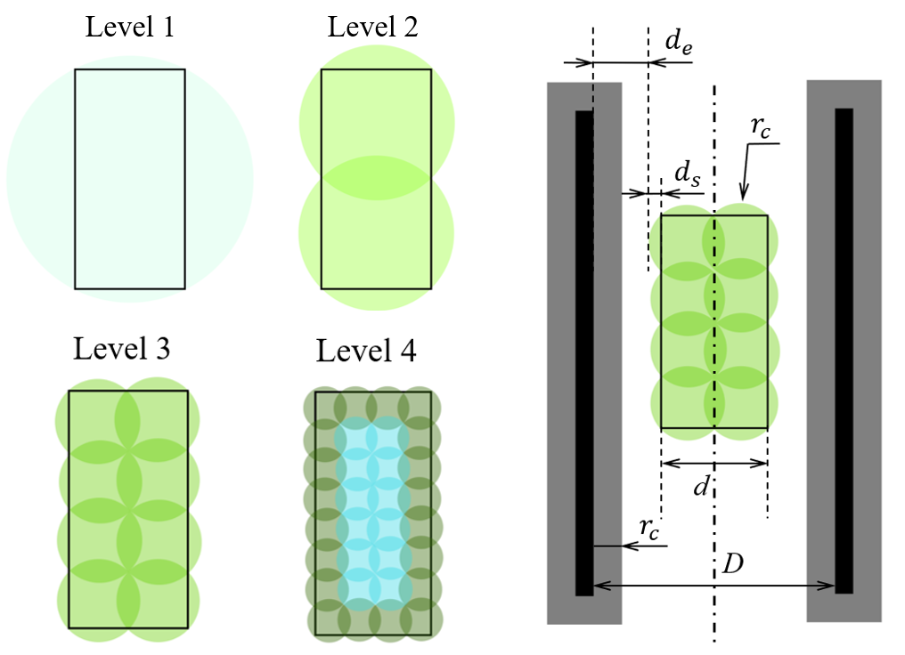
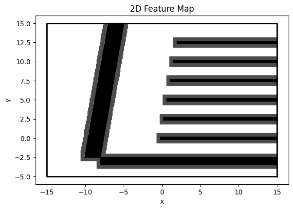
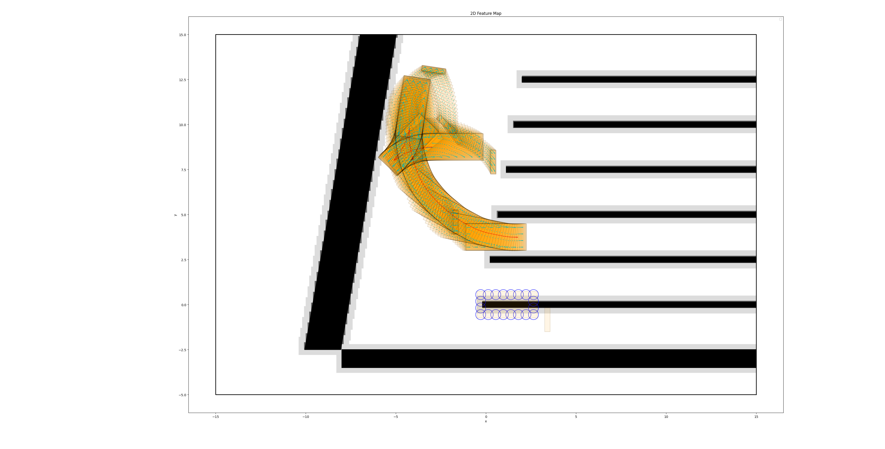
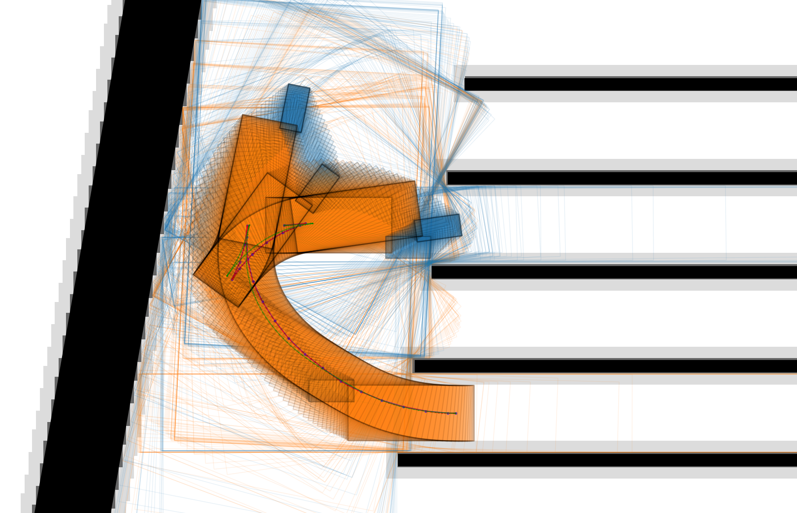
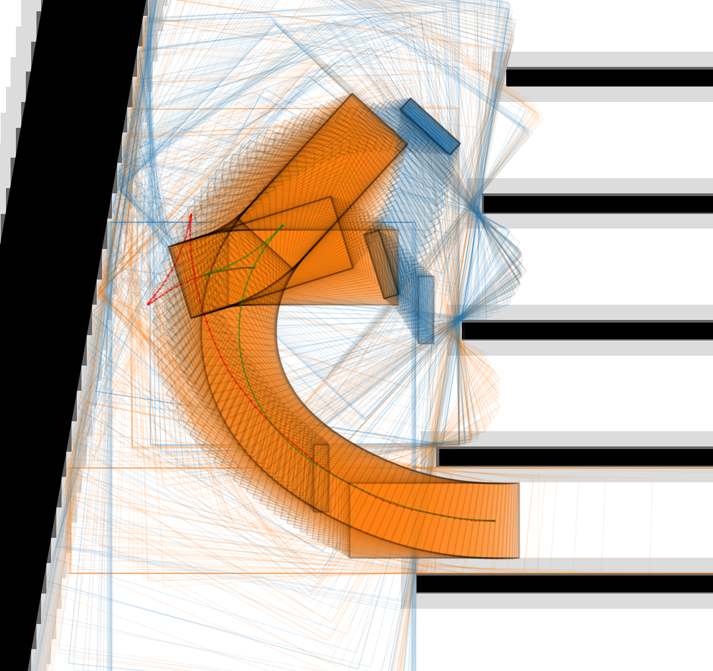
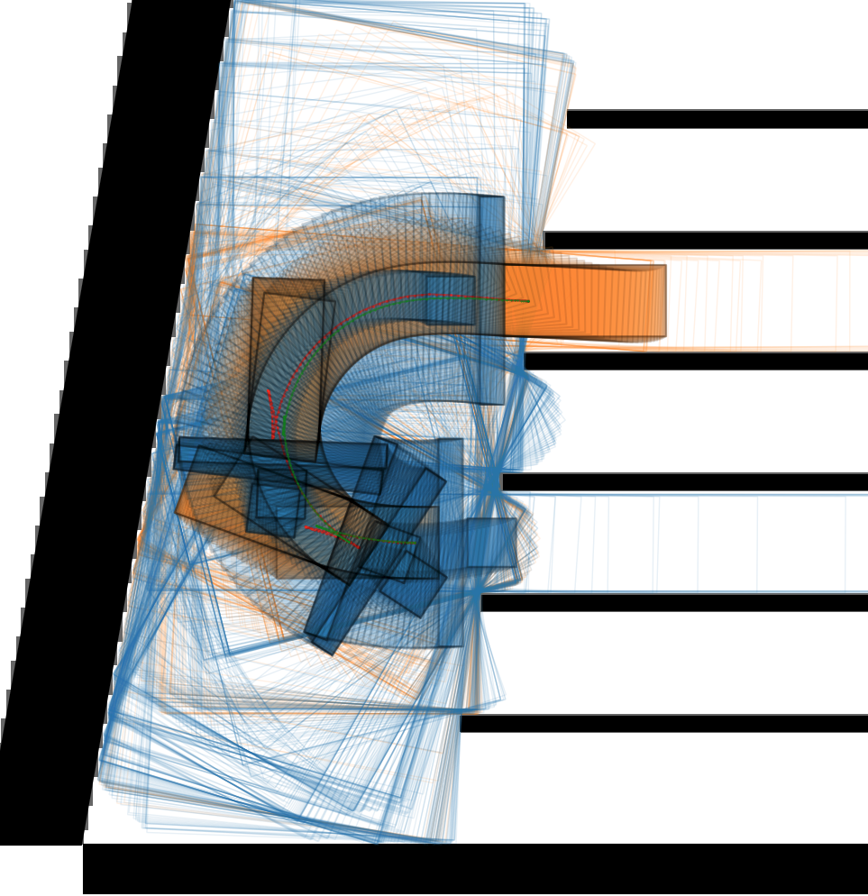

# Efficient and Safe Trajectory (EAST) Planner for Autonomous Agricultural Vehicle Headland Turning in Cluttered Orchard Environments 

[](https://ieeexplore.ieee.org/document/10854653)
[](https://arxiv.org/abs/2501.10636)
[](https://agroboticsresearch.github.io/east_planner/)


## Updates
- **[July 3, 2025]** We have released our codebase! 

- **[January 27, 2025]** Our paper "[Efficient and Safe Trajectory Planning for Autonomous Agricultural Vehicle Headland Turning in Cluttered Orchard Environments](https://ieeexplore.ieee.org/document/10854653)" has been published in *IEEE Robotics and Automation Letters (RA-L)*. 


## Overview
This repository introduces a novel method for efficient and safe trajectory planning for agricultural vehicles performing headland turning in cluttered orchard environments. Both the environment and the vehicle (including its implement) are modeled using convex polygons. The planning algorithm is implemented in C++, and the Python bindings of the core functions are provided using pybind11.

### Main Contributions

1. An efficient way of modeling the vehicle's configuration space and implemented a fast way to do the collision checking.
2. Use combinatoral safe corridors to express the manuvering space of the vehicle, as well as its added on implements. 
3. A differential based method was applied to solve the path planning problem online.

### Front-End Searching

1. The vehicle (w/o implement) is modeled with rectangles covered by circles. 
<p align="center">
   
</p>

2. Expanding the polygon geometry
<p align="center">
   
</p>

4. Searching result for a test case
<p align="center">
   
</p>

### Back-End Smoothing

For the back end smoothing, we applied combined corridors for represent the feasibility constraints. In this way, the path can be smoothed in the constrained area.

<p align="center">
   
   
   
</p>

If you have any questions, feel free to contact us: [Peng Wei](mailto:penwei@ucdavis.edu) and [Chen Peng](mailto:chen.peng@zju.edu.cn).

## BibTex
If you find this work useful for your own research, please cite the following:

```bibtex
@article{Wei_2025,
   title={Efficient and Safe Trajectory Planning for Autonomous Agricultural Vehicle Headland Turning in Cluttered Orchard Environments}, 
   author={Wei, Peng and Peng, Chen and Lu, Wenwu and Zhu, Yuankai and Vougioukas, Stavros and Fei, Zhenghao and Ge, Zhikang},
   journal={IEEE Robotics and Automation Letters}, 
   year={2025},
   volume={10},
   number={3},
   pages={2574-2581},
   doi={10.1109/LRA.2025.3534056}
}
```

## Acknowledgment
We gratefully acknowledge the use of the following open-source tools:
- [pybind11](https://github.com/pybind/pybind11) —  for Python bindings of C++ modules. 
- [qpOASES](https://github.com/coin-or/qpOASES) — for solving quadratic programming (QP) problems

## License
This project is released under the Apache License 2.0 License.